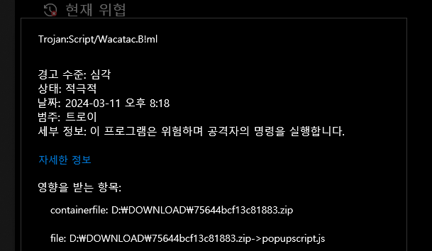
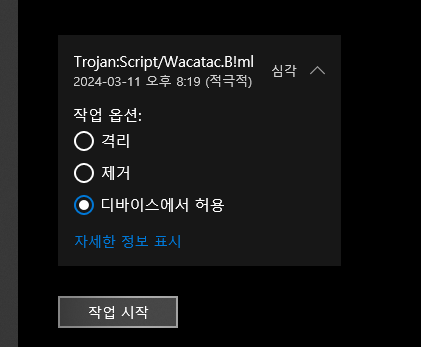

# 지원하는 기능
- 작품에서 인식하는 닉네임을 다른걸로 변경할 수 있습니다
- 작품에서 인식하는 아이디를 다른걸로 변경할 수 있습니다
- 오브젝트 리스트를 출력할 수 있습니다
- 출력한 오브젝트 리스트로 특정 오브젝트의 x좌표를 변경할 수 있습니다
- 출력한 오브젝트 리스트로 특정 오브젝트의 y좌표를 변경할 수 있습니다
- 실시간 리스트의 값을 끼울 수 있습니다
- 실시간 리스트의 값을 변경할 수 있습니다
- 실시간 리스트의 값을 제거할 수 있습니다
- 실시간 변수의 값을 변경할 수 있습니다
- 부스트 모드 감지 블록을 우회할 수 있습니다
- 반복문 프레임 제한을 해제할 수 있습니다
- 반복문 프레임 제한을 해제할 수 있습니다 (작품 만들기 페이지 용)
- 장면 제한을 무제한으로 바꿀 수 있습니다 (작품 만들기 페이지 용)
- 한국어 검열 리스트를 우회할 수 있습니다
- 대부분의 영어 링크 검열을 우회할 수 있습니다

# 다운로드시 바이러스 감지 됨
  
이유는 모르겠으나, 다운로드할 때 바이러스로 오진하는 문제가 있습니다  
  
디바이스에서 허용으로 변경 후 작업 시작을 눌러주세요  
그리고 다시 다운로드를 하시면 정상 다운로드되실겁니다  
~~아니 근데 솔직히 왜 나만 억까임; 다른 사람이 만든 확장 프로그램은 바이러스 경고 없이 잘 다운로드 되는데~~

# ㅋ
근데 zip 비번은 알 알려드림ㅋ
